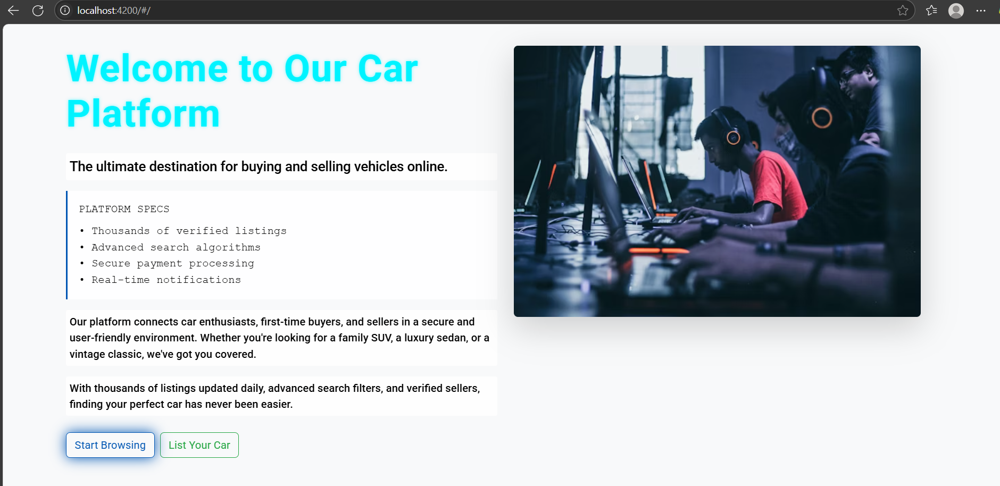

# Car_Buy_Sell
# 🚗 Car Buy/Sell App

This is a full-stack web application that allows users to buy and sell cars online. It consists of:

- 🔧 **Backend**: Spring Boot (Java)
- 🌐 **Frontend**: AngularJS
- 🗃️ **Database**: MySQL (with SQL dump provided)
- 🧪 **API Testing**: Postman (user setup recommended)

---

---

## 🧱 Tech Stack

| Layer      | Technology         |
|------------|--------------------|
| Frontend   | AngularJS          |
| Backend    | Spring Boot (Java) |
| Database   | MySQL              |
| API Tool   | Postman (optional) |

---

## ⚙️ Getting Started

### 🐘 MySQL Setup

1. Import the `carbackend_db.sql` into your MySQL:
   
   mysql -u root -p carbackend_db < carbackend_db.sql

2.Ensure your MySQL is running and your Spring Boot app is configured to connect with the same DB name.

💻 Backend (Spring Boot)
Navigate to the backend folder:

cd carbackend
Open in IDE (like IntelliJ/VS Code)

Run the Spring Boot application (CarbackendApplication.java)

Backend will start at:

http://localhost:8080

🌐 Frontend (AngularJS)

Navigate to frontend folder:
cd car
Open index.html directly in browser, or host using a live server extension in VS Code.
Make sure backend (API) is running at localhost:8080

🧪 API Testing (Postman)
This project does not include a Postman collection.
You can test the REST APIs by manually creating requests in Postman.

| Method | Endpoint         | Description   |
| ------ | ---------------- | ------------- |
| GET    | `/api/cars`      | List all cars |
| POST   | `/api/cars`      | Add new car   |
| PUT    | `/api/cars/{id}` | Update car    |
| DELETE | `/api/cars/{id}` | Delete car    |

📸 Sample Car Data
The database includes preloaded car listings with details like:

Make, Model, Price

Fuel Type, Year, Features

💡 Notes
Ensure application.properties in the backend has correct DB credentials

If ports conflict (e.g., 8080), update the backend server port in properties