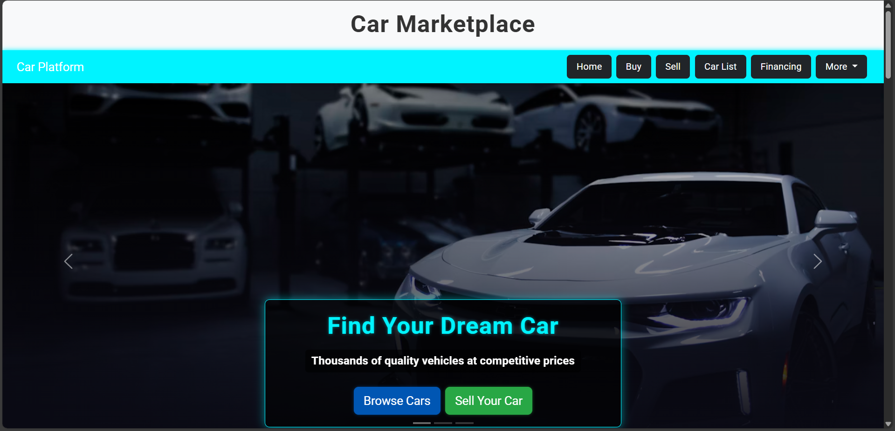
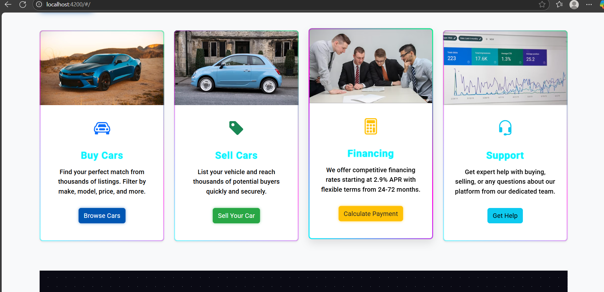

<h1 align="center">🚗 Car Buy/Sell Platform</h1>

<p align="center">
  
  
  
  
</p>

<p align="center">
  A comprehensive, full-stack web application designed to seamlessly connect car buyers and sellers in a unified, modern platform.
</p>

---

## 🔗 Live Links

- **🔴 Live Demo:** [Click Here to View Live Project](#) *(Please replace with your actual live URL)*
- **🎥 Demo Video:** [Watch Project Walkthrough](#) *(Please replace with your actual video URL)*

---

## ✨ Key Features

- **🚘 Browse Cars**: View a rich, detailed list of available cars with dynamic UI cards.
- **🔍 Detailed Specifications**: Dive deep into each car's Make, Model, Price, Year, Fuel Type, and specific features.
- **📝 Manage Listings**: Authorized users can easily add, update, and remove car listings using RESTful APIs.
- **📱 Responsive Design**: Optimized viewing experience across desktops, tablets, and mobile devices.
- **⚡ Fast Performance**: Powered by a robust Spring Boot backend paired with an efficient Angular frontend.

---

## 🏗️ Architecture & Tech Stack

### Frontend
- **Framework**: Angular
- **Styling**: Modern CSS / Bootstrap (or Tailwind if configured)
- **Role**: Delivers a responsive, single-page application (SPA) experience for users to browse and interact with vehicle data.

### Backend
- **Framework**: Spring Boot (Java)
- **Architecture**: REST API design
- **Role**: Handles business logic, data validation, and serves JSON payloads to the frontend securely.

### Database
- **Engine**: MySQL
- **Role**: Stores structured relational data for car listings, including model details, pricing, and features.

---

## 🚀 Getting Started

Follow these instructions to get a copy of the project up and running on your local machine for development and testing purposes.

### 1. Database Setup

1. Install MySQL and ensure the server is running.
2. Open your MySQL command line or a GUI tool (like MySQL Workbench).
3. Create the database and import the provided SQL dump:
   ```bash
   mysql -u root -p < car_buy_sell_db.sql
   ```
*(Note: If the dump is named `carbackend_db.sql`, adjust the filename accordingly).*

### 2. Backend Setup (Spring Boot)

1. Open your terminal and navigate to the backend directory:
   ```bash
   cd carbackend
   ```
2. Open the project in your IDE (IntelliJ IDEA, Eclipse, VS Code).
3. Configure your database credentials. Open `src/main/resources/application.properties` and ensure they match your local MySQL setup:
   ```properties
   spring.datasource.url=jdbc:mysql://localhost:3306/carbackend_db
   spring.datasource.username=root
   spring.datasource.password=your_password
   ```
4. Run the Spring Boot application (e.g., executing `CarbackendApplication.java`).
5. The API will be available at `http://localhost:8080`.

### 3. Frontend Setup (Angular)

1. Open a new terminal window and navigate to the frontend directory:
   ```bash
   cd car
   ```
2. Install the necessary NPM packages:
   ```bash
   npm install
   ```
3. Start the Angular development server:
   ```bash
   ng serve  # Or npm start
   ```
4. Open your browser and navigate to `http://localhost:4200/` (or the port specified by Angular). Ensure your backend is running simultaneously.

---

## 📡 API Reference

You can easily interact with the backend using Postman or cURL.

| HTTP Method | Endpoint | Description |
| :--- | :--- | :--- |
| `GET` | `/api/cars` | Retrieves a list of all available cars |
| `POST` | `/api/cars` | Creates a new car listing |
| `PUT` | `/api/cars/{id}` | Updates an existing car listing by ID |
| `DELETE`| `/api/cars/{id}` | Deletes a car listing by ID |

---

## 📸 Screenshots
*(Add your screenshots here! Example:)*
```markdown


```

---

<p align="center">
  Built with ❤️ for Car Enthusiasts
</p>